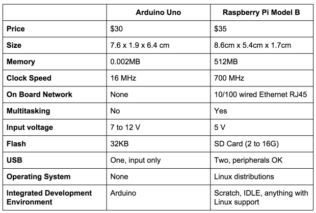
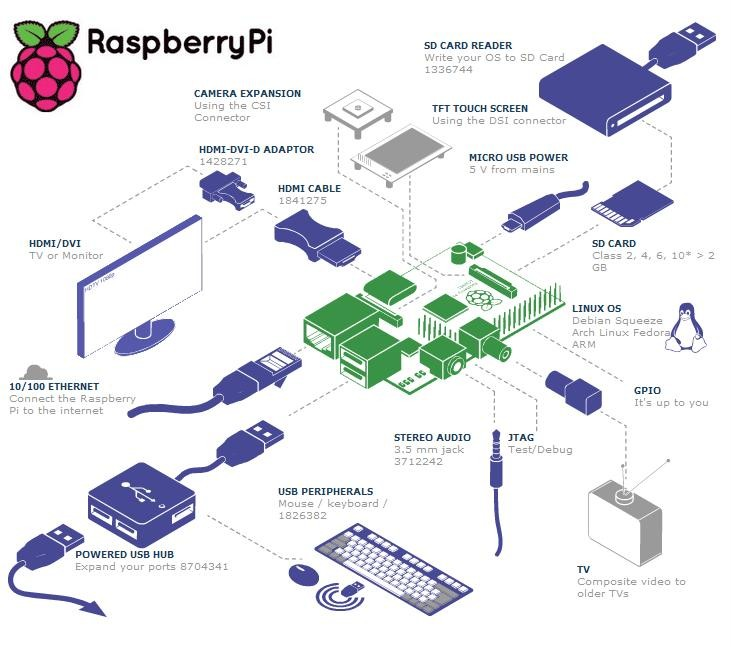
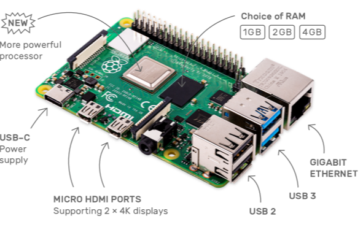

## General

* Comprobar que las fotos no son enlaces a páginas web, si no que se han descargado y tienen extensión parecida a jpg, png... en los temas anteriores a 2.2 que no he revisado en ese aspecto.
* Revisar que siempre se dice que la última es la Raspberry Pi 5
* hablar de la Pico
* VNC/Connect 
* ~~Materiales~~
* Hacer lista de materiales para el Robot
* Raspi FAQ

## RasPi FAQ

* ¿Eliminar esta pregunta o actualizarla ?¿De verdad cuesta 35$?
	La placa sí, pero por si misma no es más que un pisapapeles Geek, necesitamos cómo mínimo la tarjeta SD y la alimentación.

## ~~Tema 1~~

* ~~Raspberry Pi vs Arduino en 1.1~~

* ~~Comprobar si los datos de imagen están actualizados ~~
* 1.2 ~~En Distribuciones ~~
	* ~~Occidentalis:  https://learn.adafruit.com/adafruit-raspberry-pi-educational-linux-distro  en este enlace aparece en inglés esta nota *-**~~~~Este tutorial puede estar desactualizado. Ya no se recomienda para principiantes y es posible que necesite modificaciones de código o hardware que no se indican en el tutorial~~-~~***.~~
	* ~~Servidor de contenidos educativos: Revisar si son 100$~~
* ~~Instrumentación de laboratorio~~
	* ~~Generadores de Onda, enlace: https://learn.adafruit.com/mcp4725-12-bit-dac-with-raspberry-piEste tutorial puede estar desactualizado. Ya no se recomienda para principiantes y es posible que necesite modificaciones de código o hardware que no se indican en el tutorial.Los ejemplos de esta guía ya no son compatibles. Consulte la guía tutorial del DAC de 12 bits MCP4725 para el uso de CircuitPython y Python: https://learn.adafruit.com/mcp4725-12-bit-dac-tutoria~~
* ~~Radio Wifi : en la página del enlace https://learn.adafruit.com/pi-wifi-radio?view=all , pone TENGA EN CUENTA:~~ **~~esta guía ahora está obsoleta... Este tutorial puede estar desactualizado. Ya no se recomienda para principiantes y es posible que necesite modificaciones de código o hardware que no se indican en el tutorial~~**.
* ~~Robots: enlace como conectar la Raspberry con Lego Mindstorm https://learn.sparkfun.com/tutorials/getting-started-with-the-brickpi?_ga=1.260570443.733603098.1443800444 Aparece este mensaje ~~**~~¡Este tutorial está retirado! Este tutorial cubre conceptos o tecnologías que ya no están vigentes~~**.~~ Todavía está aquí para que lo lea y lo disfrute, pero puede que no sea tan útil como nuestros tutoriales más recientes.~~
* ~~Máquinas de juegos~~:
	~~Mame: en el enlace aparece Este contenido incrustado proviene de un sitio (www.youtube.com, flickr.com, etc.) que no cumple con la configuración No rastrear (DNT) ahora habilitada en su navegador. Al hacer clic en el contenido incrustado, el proveedor de incrustaciones le permitirá realizar un seguimiento.~~
	* ~~Mini máquina recreativa: https://learn.adafruit.com/cupcade-raspberry-pi-micro-mini-arcade-game-cabinet?view=all en el enlace aparece Este contenido incrustado proviene de un sitio (www.youtube.com, flickr.com, etc.) que no cumple con la configuración No rastrear (DNT) ahora habilitada en su navegador. Al hacer clic en el contenido incrustado, el proveedor de incrustaciones le permitirá realizar un seguimiento~~
	* ~~Juegos portables: https://learn.adafruit.com/pigrrl-raspberry-pi-gameboy?view=all  en el enlace aparece *Este contenido incrustado proviene de un sitio (www.youtube.com, flickr.com, etc.) que no cumple con la configuración No rastrear (DNT) ahora habilitada en su navegador. Al hacer clic en el contenido incrustado, el proveedor de incrustaciones le permitirá realizar un seguimiento.~~
	* ~~Súper Consola: https://learn.adafruit.com/super-game-pi?view=all en el enlace aparece un aviso Este contenido incrustado proviene de un sitio (www.youtube.com, flickr.com, etc.) que no cumple con la configuración No rastrear (DNT) ahora habilitada en su navegador. Al hacer clic en el contenido incrustado, el proveedor de incrustaciones le permitirá realizar un seguimiento.*~~
* ~~Ordenadores y material informático~~:
	
	* ~~pi-Top, imagen obsoleta ~~
* ~~Servidor NAS, actualizar enlace o modificar la información, es de 2016  https://www.adslzone.net/2016/08/24/convierte-cualquier-disco-duro-nas-gracias-la-raspberry-pi-3/~~
* ~~Cluster de supercomputación  actualizar enlace o modificar la información, es de 2014 http://www.cyberhades.com/2014/02/19/tutorial-para-instalar-un-cluster-de-40-nodos-con-raspberry-pi/ foto obsoleta ~~
* ~~Minería de BitCoin https://learn.adafruit.com/piminer-raspberry-pi-bitcoin-miner  error 404, página no encontrada.~~
* ~~http://www.davidhunt.ie/wp-content/uploads/2013/01/IMG_7585.jpg~~

## Tema 2

* ~~Añadir la Raspi 5 a versiones y arquitectura~~

* ~~Actualizar esquema de 2.1 a una versión más moderna~~

* 2.3.1 RockPi incluir

* Actualizar imagen* 

* Tema 2.2. versiones
	* Creo que ~~la foto de Raspberry Pi 4 debería actualizarse a la nueva placa Raspberry Pi 5 y~~ traducir si es posible, los nombres de los componentes que hay detallados en la misma* 
	* ~~Raspberry Pi 5 (incluir esta versión en la tabla comparativa) vs Raspberry Pi 4 vs Raspberry Pi 3 B+ y eliminar el precio para evitar que se note el paso del tiempo en la actualización.~~
	
	* Dispositivos para conectar: si es posible, en algún momento, tal vez deberían traducirse los nombres de los componentes. 
	
	
	* Características Raspberry Pi 4: si es posible, en algún momento, tal vez deberían traducirse los nombres de los componentes.

## Tema 4

* Añadir Octoprint del curso de impresión 3D 7.5.1

