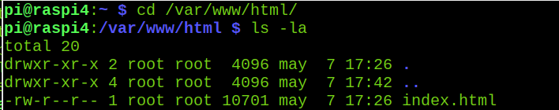
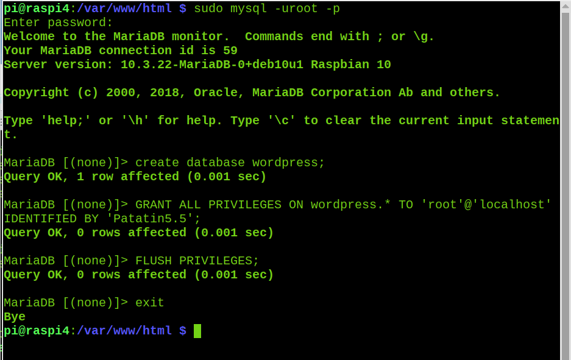

## Instalaci''on de servidor Web (LAMP)

Vamos a instalar un t'ipico servidor servidor LAMP: Linux, Apache, MariaDB (originariamente MySQL) & PHP que es la base de la mayor'ia de los servidor web que hay en internet.

Para ver que funciona y es compatible instalaremos una instacia del conocido gestor de contenidos Wordpress

1. Apache

Vamos a instalar el servidor Web propiamente dicho. Para instalar el servidor apache 
```sh
sudo apt install apache2 -y
```
Ahora hacemos un test para ver si está bien instalado  y funcionando para lo que abriremos un navegador en la propia Raspberry a la direcci'on local http://localhost
```
http://localhost
```


2. Acceso remoto

Vamos a probar ahora si podemos acceder desde otro ordenador. Para ello vamos a ver cu'al es nuestra direcci'on IP con . Ponemos en la terminal 
```sh
hostname -I
```

Ahora nos conctamos con un navegador desde otro ordenadore con la ip resultante http://192.168.1.36

Si todo va bien veremos la mism p'agina de antes.

3. Cambiar la p'agina inicial

El contenido HTML del sevidor se encuentra en **/var/www/html/** y por defecto se env'ia el fichero **index.html**



Vemos que el fichero es propiedad de root, con lo que necesitamos usar sudo para modificarlo. Si controlas HTML puede modificarlo con

sudo geany index.html

4. Instalaci'on de PHP

Una gran parte del c'odigo que se ejecuta en el servidor web est'a escrito en  PHP, con lo que necesitamos instalarlo. Lo hacemo con

sudo apt install php -y

Para probar que funciona vamos a crear un fichero index.php (en el directorio raiz de www)

sudo geany index.php

con el siguiente contenido:

<?php echo date('Y-m-d H:i:s'); ?>

</br>

<?php echo "hola Apache y php"; ?>

</br>

<?php phpinfo(); ?>

Para probar que funciona abriremos en un navegador la p'agina http://192.168.1.36/index.php
(ahora anadimos el nombre del fichero ya que por defecto se busca el fichero index.html y de esta manera forzamos a se muestre el otro fichero(
Si todo va bien veremos el mensaje "hola Apache y php", la hora y fecha actual y un mont'on de informaci'on sobre lphp y los m'odulos instalados en el navegador

6. Instalaci'on de la base de datos

Vamos a instalar ahora la base de datos con el comando

sudo apt-get install mariadb-server-10.3

Instalamos el paquete de conexi'on php/MariaDB

sudo apt install php-mysql

y rearrancamos el servidor

sudo service apache2 restart

7. Wordpress

Wordpress es uno de los gestores de contenidos de codigo abierto m'as utilizados. 
Vamos a descargar un paquete con la 'ultima versi'on y lo vamos a poner en la carpeta de contenidos de www con

sudo wget http://wordpress.org/latest.tar.gz

Borramos los ficheros index.* con

sudo rm index.*

Lo descomprimimos  con

sudo tar xvf latest.tar.gz

Borramos el fichero comprimdo

sudo rm  latest.tar.gz

y movemos todo el contenido a la caperta raiz del servidor

sudo mv wordpress/* .

Wordpress tiene una estructura compleja que podemos ver con el comando

tree

Por tema de seguridad todos los ficheros deben pertenecer al usuario www-data

sudo chown -R www-data: .

8. Configuraci'on de la base de datos

Vamos a ejecutar el asistente para la instalaci'on segura de la base de datos

sudo mysql_secure_installation

Inicialmente no tiene contrasena pero debemos poner una

Despu'es contestaremos Y a todas las preguntas para una m'axima seguridad

Ahora vamos a crear la base de datos que necesita Wordpress

sudo mysql -uroot -p

Ponemos nuestra contrasena y ahora creamos la base de datos wordpress con

create database wordpress;

GRANT ALL PRIVILEGES ON wordpress.* TO 'root'@'localhost' IDENTIFIED BY 'TUCONTRASENA';

FLUSH PRIVILEGES;

exit



9. Configuraci'on de Wordpress

Volvemos a entrar con un navegador en nuestro servidor con http://localhost

Veremos una pagina para seleccionar el idioma


Ahora rellenamos los datos de acceso a la base de datos 


Configuramos los datos del usuario del blog

Y listo!!!
