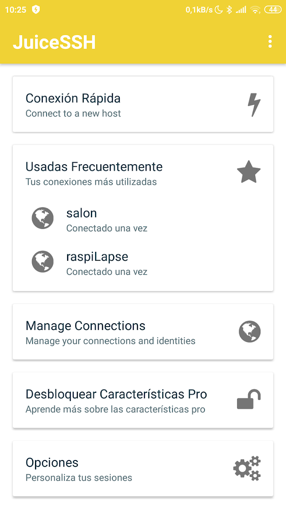

create a empty ssh file "ssh" in the root for start ssh on boot time


### Automatizar conexiones

Para automatizarlos podemos añadir nuestra **clave pública ssh** a la lista de host autorizados, haciendo lo siguiente:

* Generar nuestra **clave pública ssh**, asociada al usuario y la máquina
```sh
ssh-keygen -t rsa -b 4096 -C user@email.com
```
* Ahora copiamos nuestra clave pública ssh a 
```sh
cat ~/.ssh/id_rsa.pub | ssh username@server.address.com 'cat >> ~/.ssh/authorized_keys'
```


Vídeo de JuiceSSH


